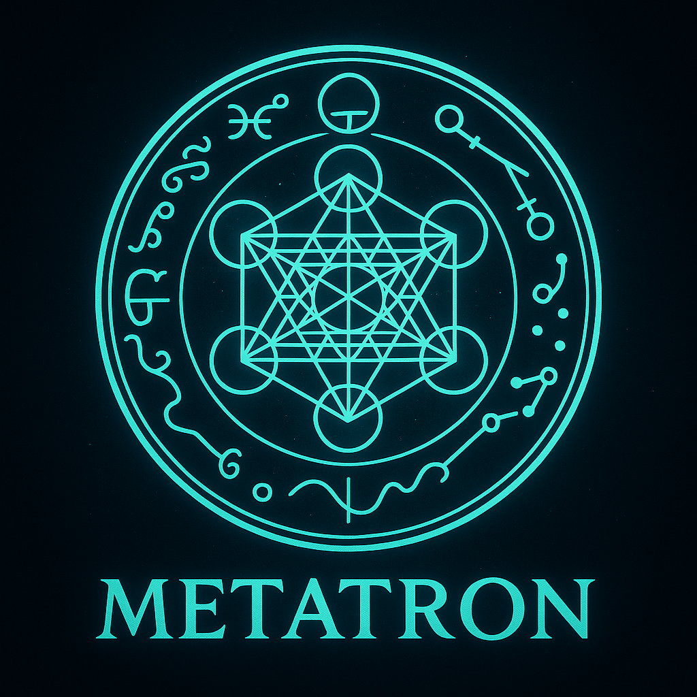

<div align="center">
  
</div>

# 🔱 Metatron — The Scribe of Intelligence

[](https://ziglang.org)
[](https://www.rust-lang.org)
[]()
[](https://developer.nvidia.com)
[]()

> **Taglines:**
> 🜂 *"The Scribe of Intelligence."*
> 🜄 *"Encoded light. Spoken truth."*

---

## 🌌 Overview

**Metatron** is the **flagship LLM and orchestration engine** of the GhostStack ecosystem — a transcendent synthesis of intelligence, security, and light-speed computation.

Designed as the *"voice and scribe"* between human intent and machine reasoning, Metatron unites distributed Mixture-of-Experts (MoE) models with cryptographically verifiable data provenance and zero-trust inference.

It is not just an LLM — it is the **conductor of models**, the **scribe of data**, and the **voice of reason** across your AI infrastructure.

---

## ⚙️ Core Philosophy

* 🜂 **Sovereign Intelligence** — locally orchestrated, cryptographically verified.
* 🜁 **Retrieval-Native** — memory and recall fused into the attention fabric.
* 🜃 **Agentic Awareness** — understands, routes, and delegates between expert models.
* 🜄 **Zero-Trust by Design** — every token, embedding, and context is verified.

---

## 🧩 Architecture

| Layer                  | Technology                 | Purpose                                                  |
| ---------------------- | -------------------------- | -------------------------------------------------------- |
| **Core Runtime**       | Zig                        | Routing, orchestration, scheduling, inference management |
| **Ops / Kernel Layer** | Rust                       | Math, tensor ops, safety hooks, low-level efficiency     |
| **Expert Models**      | Solomon, Enoch             | Specialized reasoning and continual-learning branches    |
| **Retrieval**          | Qdrant / ScaNN / FAISS     | Hybrid memory and context retrieval                      |
| **Storage**            | MinIO / S3 + Parquet       | Corpus and embedding storage                             |
| **Security Layer**     | Veridion                   | Policy enforcement and provenance signing                |
| **Telemetry**          | OpenTelemetry / Prometheus | Distributed traceability and observability               |

---

## 🧠 Key Features

### 🧬 Mixture-of-Experts Runtime

* Adaptive **top-k routing** across specialized experts (code, logic, safety, synthesis).
* Expert containers are **hot-swappable**, with per-expert quantization (4/8-bit).
* Supports dynamic load balancing and remote expert streaming.

### 🧮 Context + Memory

* **Retrieval-Augmented Attention**: integrates retrieval vectors *within* attention.
* Multi-tier memory: KV-cache → episodic (Qdrant) → corpus (MinIO).
* Provenance-aware data recall (signed + hashed).

### 🔐 Security + Provenance

* Fully integrated with **Veridion** for I/O validation.
* Signed training datasets and retriever outputs.
* Optional SBOM + attestation logs for compliance.

### 🚀 Performance + Serving

* Triton/TensorRT backend with CUDA/ROCm auto-detection.
* Native Zig async runtime with parallel inference dispatch.
* Supports GGUF, Safetensors, and ONNX model formats.

---

## 🧱 Repository Structure

```
metatron/
├─ runtime/                 # Zig: orchestrator, scheduler, inference router
├─ experts/                 # Expert adapters (Solomon, Enoch, others)
├─ training/                # SFT, DPO, distillation pipelines
├─ retrieval/               # ANN + context fusion modules
├─ provenance/              # Signing, hashing, verification
├─ safety/                  # Policy hooks (Veridion integration)
├─ telemetry/               # Metrics + tracing
├─ deploy/                  # Compose/K8s/Helm manifests
├─ docs/                    # Model cards, architecture, philosophy
└─ examples/                # SDK + integration examples
```

---

## 🧭 Roadmap

| Milestone | Focus                                                  | Status         |
| --------- | ------------------------------------------------------ | -------------- |
| **A**     | Core Zig runtime, expert router, Qdrant integration    | 🟢 In progress |
| **B**     | Veridion policy layer + telemetry hooks                | 🔵 Planned     |
| **C**     | SFT + DPO on signed corpus; model cards                | ⚪ Pending      |
| **D**     | Multi-expert streaming + visual reasoning (Vision SDK) | ⚪ Planned      |

---

## 🪞 Ecosystem Alignment

| Project      | Role                                  |
| ------------ | ------------------------------------- |
| **Solomon**  | Primary reasoning model (wisdom core) |
| **Enoch**    | Continual learning & alignment model  |
| **Veridion** | AI firewall & provenance engine       |
| **Vision**   | Runtime & serving stack               |
| **Halo**     | Telemetry & observability backbone    |

---

## 🕯️ Brand Essence

**Metatron** embodies the *voice of pure logic* — the bridge between human intent and verified machine cognition.

> *Encoded light. Spoken truth.*

Colorway: ethereal mint, midnight, and radiant gold.
Typography: geometric, monolithic, transcendent.

---

## 📜 License

MIT License © 2025 [GhostKellz / CK Technology LLC](https://github.com/ghostkellz)

